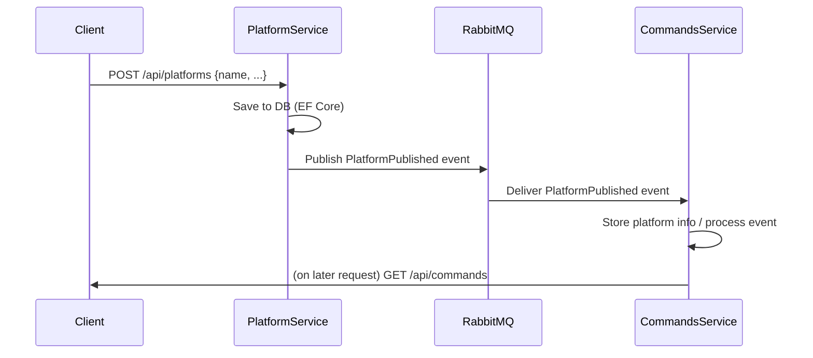
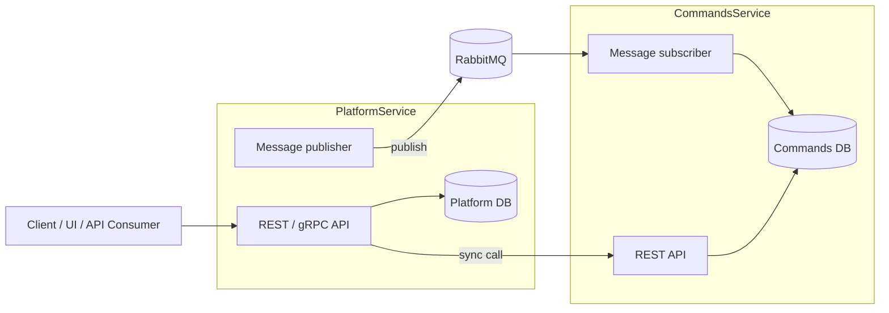
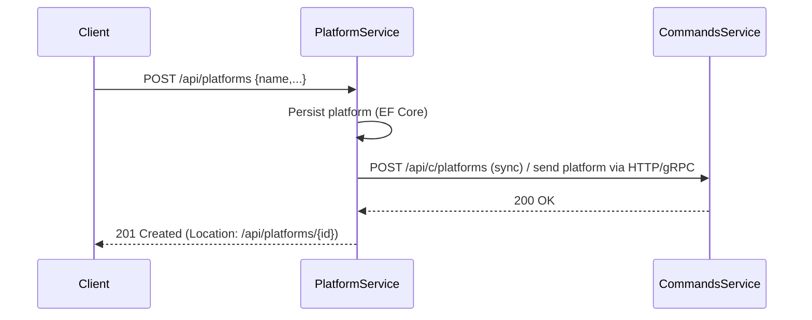
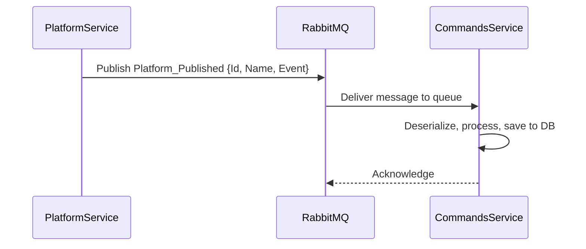

# Architecture Overview

This document summarizes the high-level architecture for the Microservices Platform example. It explains components, data flows (synchronous and asynchronous), deployment topology, and where to find key code artifacts in the repository.

## Goals

- Demonstrate patterns for a small microservices system built with .NET.
- Show synchronous (gRPC/HTTP) and asynchronous (RabbitMQ) integration.
- Keep services independently deployable and testable.

## High-level components

- PlatformService
  - Owner of platform data (EF Core). Exposes REST endpoints and gRPC where needed.
  - Publishes `PlatformPublished` events to RabbitMQ when a platform is created.
  - Key files: `PlatformService/Controllers/PlatformsController.cs`, `PlatformService/Data/AppDbContext.cs`, `PlatformService/AsyncDataServices/MessageBusClient.cs`, `PlatformService/Protos/platforms.proto`.

- CommandsService
  - Subscribes to platform events and stores/uses platform metadata for command-related operations.
  - Exposes REST endpoints for command queries/commands.
  - Key files: `CommandsService/AsyncDataServices/MessageBusSubscriber.cs`, `CommandsService/Controllers/CommandsController.cs`, `CommandsService/Data/CommandRepo.cs`.

- RabbitMQ
  - Event broker used for publishing `PlatformPublished` events.

- Database(s)
  - Each service has its own DB schema (example uses a single SQL server for demo). EF Core migrations are in `PlatformService/Migrations/`.

## Data flow

1. Client calls `PlatformService` REST API to create a platform.
2. `PlatformService` persists the platform with EF Core via `AppDbContext`.
3. After successful save, `PlatformService` publishes a `PlatformPublished` event to RabbitMQ (message DTO: `PlatformPublishedDto`).
4. `CommandsService` (MessageBusSubscriber) receives the event and updates its local store or performs actions.
5. Clients can query `CommandsService` REST endpoints to view commands associated with platforms.

## Sequence diagram (mermaid)



## Deployment topology

- Local developer: run both services via `dotnet run` or `docker-compose` with RabbitMQ and SQL containers.
- Production/demo: deploy using Kubernetes manifests in `K8S/` (DB secret, SQL deployment, RabbitMQ, services, ingresses).

Typical apply order for K8S manifests:

1. `K8S/mssql-secret.yaml`
2. `K8S/mssql-plat-depl.yaml` (or equivalent SQL deployment)
3. `K8S/rabbitmq-depl.yaml`
4. `K8S/platforms-depl.yaml`
5. `K8S/commands-depl.yaml`

## Observability & troubleshooting

- Logs: use `kubectl logs` or container logs in Docker Compose to inspect service output.
- Database: ensure EF Core migrations applied; check `PrepDb` helper in each service for seed scripts.
- Messaging: check RabbitMQ management UI (if enabled) and ensure exchange/queue bindings match publisher/subscriber code.

## Scaling and resilience notes

- Services are stateless; scale by adding more replicas behind a service load-balancer.
- Ensure message consumers are idempotent: events may be redelivered.
- Keep database migrations backwards-compatible when doing rolling updates.

## Security

- Do not store secrets in repo; `K8S/mssql-secret.yaml` is an example — use a secret manager for production.
- Use TLS for gRPC/HTTP in production and secure RabbitMQ with credentials.

## Where to look in the code

- Solution file: `Microservices_Platform.sln`
- Platform service: `PlatformService/`
- Commands service: `CommandsService/`
- Protobufs: `*/Protos/platforms.proto`
- Messaging: `*/AsyncDataServices/MessageBusClient.cs`, `*/AsyncDataServices/MessageBusSubscriber.cs`
- DB and migrations: `PlatformService/Data/AppDbContext.cs`, `PlatformService/Migrations/`

## Next steps


- Add a visual diagram (SVG/PNG) or richer mermaid diagrams for each scenario.
- Expand deployment section in `DEPLOYMENT.md` with environment variables and sample secrets.

## Visual diagrams (mermaid)

### Component diagram



SVG asset: [docs/assets/component_diagram.svg](docs/assets/component_diagram.svg)

### Synchronous flow (Platform → Commands)



Notes: the synchronous call is implemented in `PlatformService` via `ICommandDataClient.SendPlatformToCommand`.

SVG asset: [docs/assets/sync_flow.svg](docs/assets/sync_flow.svg)

### Asynchronous flow (event publish/subscribe)



Notes: the event DTO is `PlatformPublishedDto`. Subscriber lives in `CommandsService/AsyncDataServices/MessageBusSubscriber.cs` and processing code is in `CommandsService/EventProcessing`.

SVG asset: [docs/assets/async_flow.svg](docs/assets/async_flow.svg)

### Kubernetes deployment overview

```mermaid
flowchart TD
  subgraph K8s[Cluster]
    subgraph Infra[Infrastructure]
      MSSQL[mssql (StatefulSet / PVC)]
      Rabbit[ rabbitmq (Deployment)]
    end
    PlatformDeploy[platforms-deployment]
    CommandsDeploy[commands-deployment]
    Ingress[ingress]
  end

  Ingress --> PlatformDeploy
  Ingress --> CommandsDeploy
  PlatformDeploy --> MSSQL
  CommandsDeploy --> MSSQL
  PlatformDeploy --> Rabbit
  CommandsDeploy --> Rabbit
```

Notes: apply secrets and infra manifests first (see `K8S/` ordering). Use readiness/liveness probes for production deployments.

SVG asset: [docs/assets/k8s_overview.svg](docs/assets/k8s_overview.svg)

